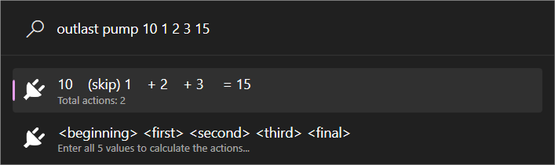

# Outlast Trials Utilities

These are small tools to help you play The Outlast Trials.

- [Outlast Trials Utilities](#outlast-trials-utilities)
- [Install](#install)
- [Usage](#usage)
  - [Shock Timer](#shock-timer)
    - [Controls](#controls)
    - [Is it cheating?](#is-it-cheating)
  - [Pump Calculator](#pump-calculator)
    - [Controls](#controls-1)
- [Develop](#develop)
- [Release](#release)

# Install

1. Download [`OutlastTrials-{version}-{arch}.zip`](https://github.com/Caceresenzo/Community.PowerToys.Run.Plugin.OutlastTrials/releases).
2. Unzip it into `%LOCALAPPDATA%\Microsoft\PowerToys\PowerToys Run\Plugins`.

# Usage

## Shock Timer

Use the on-screen indicator to keep track of the Toxic Shock and Cold Snap cycles:

### Controls

- **Synchronize at Cycle**: Reset the timer to the length of the cycle. This must be done when the voice says "Ended" and before you leave your hiding place.
- **Synchronize at Callout**: Reset the timer to the beginning of the hiding time. This must be done when the voice says the name of the shock, such as "Toxic" or "Cold."
- **Remove the timer**: Disable and remove the timer. This must be used when a therapy ends.
- **Cold Snap** or **Toxic Shock**: Restart the timer using the new times.

### Is it cheating?

**No.**

The program never reads or writes to the game's memory. Users must properly synchronize the in-game internal timer with the on-screen timer.

## Pump Calculator

Solve the small pumps puzzle quickly in the trial "Kill the Politician".

### Controls

- Validating any action resets the inputs for a quick retry.
- The calculator cannot start unless all values are numbers.

# Develop

Run the script [deploy.ps1](./deploy.ps1).

The logs will be located at: `%LOCALAPPDATA%\Microsoft\PowerToys\PowerToys Run\Logs\OutlastTrials`

# Release

Run the script [pack.ps1](./pack.ps1).
